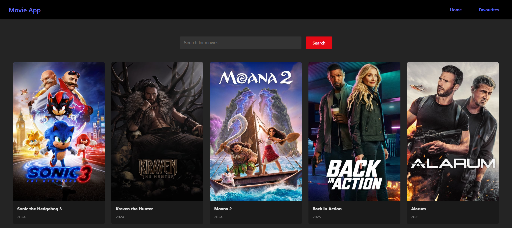
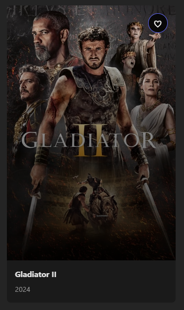
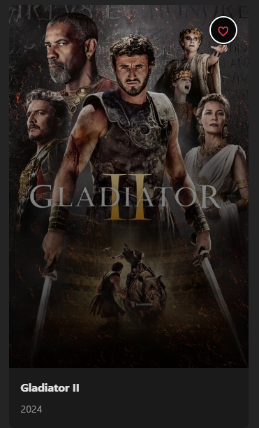
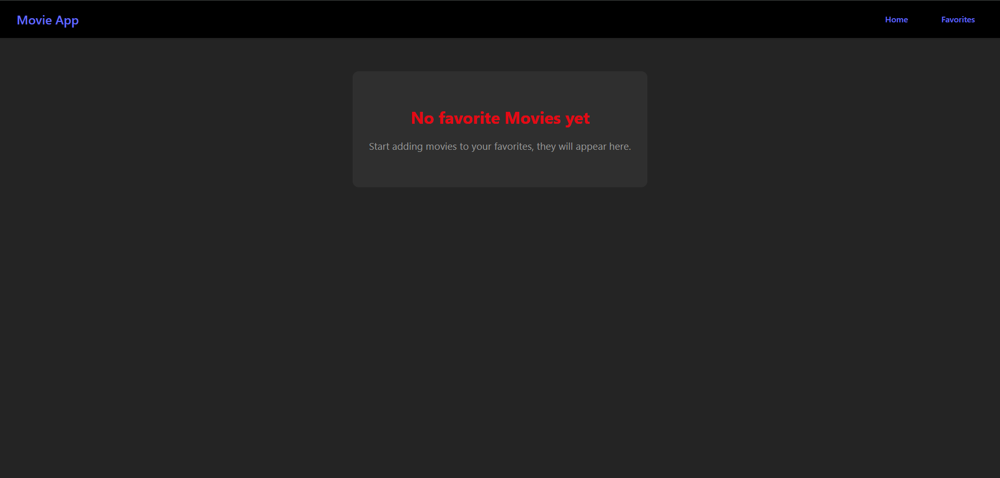
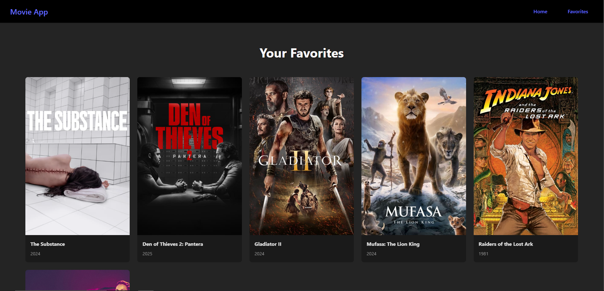

# React Film App
This app has been made following a Youtube tutorial please go and support his Youtube channel, details below.

* Channel: [Tech with Tim](https://www.youtube.com/@TechWithTim) 
* Video: [Learn React With This ONE Project](https://www.youtube.com/watch?v=G6D9cBaLViA&t=4835s)
* Tim's Github: [techwithtim](https://github.com/techwithtim)

# Design
### Home page
This is how the home page loks currently. You can 'like' movies and add them to your favourites.

### Movie Tile (Default)
Each movie tile has the title, date (year) and a favorite button in the shape of a heart.

### Movie Tile (Favorite)
This is the movie tile after the movie has been favorited, the favorite button changes color to red.

### Favorites Page (Blank)
This is the how the favorites page appears when no movie is favorited.

### Favorites Page (Populated)
This is the favorites page populated with your favorite movies.

# Extra Deveolpment
I am looking to add functionality to the app so that when a user clicks on a tile, they are taken to the MovieDB
website for that movie so they can read more about it.